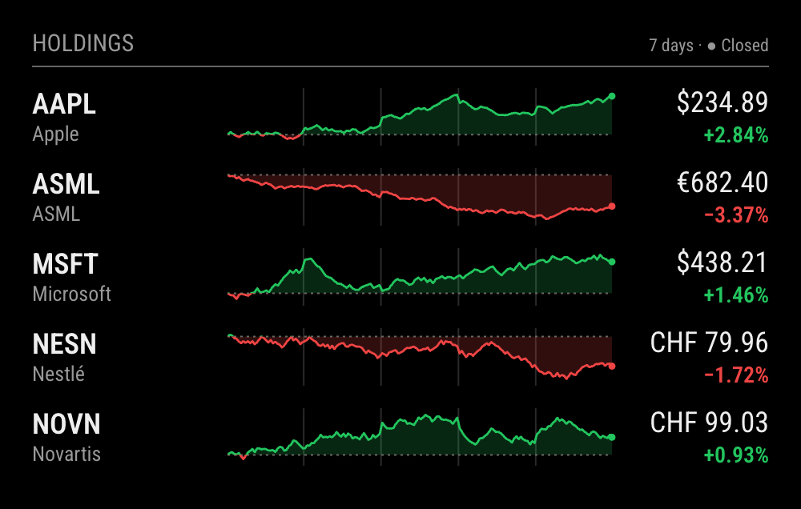
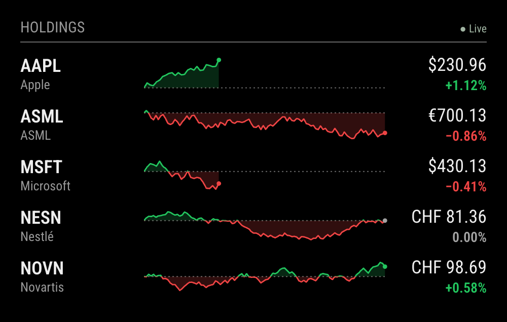

# MMM-IBKRHoldings

A quiet **MagicMirror² stock widget for Interactive Brokers accounts**. It reads which
stocks you hold from an IBKR Flex Web Service statement and draws each one as a small
Yahoo Finance–style line of the last seven days (or today's session), with the last price
and the change. It never shows **how many** shares you hold or what they are worth, so
the mirror can hang in a hallway without telling visitors anything about your account.



*Demo rendering with invented holdings and generated prices, at 2× scale.*

- Holdings come from IBKR itself, so the list follows your trades without editing `config.js`.
- **No share counts, position values, weights, cost basis or P&L** on screen, in the browser
  or on disk. The node helper sends the display only symbols, names and public quotes.
- 7-day chart drawn bar by bar like Yahoo's 5D view: nights and weekends take no room and a
  faint line marks each new session. `days: 1` shows the current session instead.
- Dotted reference close; line and fill are green above it and red below. A change that rounds
  to 0.00% is grey, never a red "−0.00%".
- *Live* / *Closed* / *Stale* / *Offline* status; fast refresh only while a market is open.
- Most European, Canadian, Hong Kong, Japanese, Australian and Singapore listings map to
  Yahoo symbols automatically; overrides for everything else.
- Flex token kept in `~/.config/MMM-IBKRHoldings/`, not in `config.js`.
- No runtime dependencies, no `npm install`, no build step. Runs on Node 10 / Electron 16.



*`days: 1` during the US session: US lines fill the part of the day that has traded so far;
the European sessions are complete. NESN shows a change that rounds to zero.*

## Install

```sh
cd ~/MagicMirror/modules
git clone https://github.com/mkubicek/MMM-IBKRHoldings.git
```

No `npm install` is needed on the mirror. Then set up IBKR access (next section) and add
the module to `config/config.js`:

```js
{
  module: "MMM-IBKRHoldings",
  position: "bottom_left",
  config: {
    maximumEntries: 8
  }
}
```

Restart MagicMirror with your usual process manager (for example `pm2 restart mm`). The
module draws its own header from `title`; MagicMirror's `header` setting is not needed.

## IBKR setup: a Flex query and a token

The module uses IBKR's [Flex Web Service](https://www.ibkrguides.com/clientportal/performanceandstatements/flex-web-service.htm),
which lets a program download a report you have defined in the IBKR portal. You need two
values: a **query ID** (which report) and a **token** (permission to download reports).
Both are specific to your account; keep them out of screenshots, issues and `config.js`.

1. **Create an Activity Flex Query** ([IBKR guide](https://www.ibkrguides.com/clientportal/performanceandstatements/activityflex.htm)):
   Portal → *Performance & Reports* → *Flex Queries* → **+** next to *Activity Flex Query*.
   - Name it, for example, `Mirror holdings`.
   - Sections: select only **Open Positions**; options *Summary*. The fields the module reads
     are *Asset Class*, *Symbol*, *Description*, *Conid*, *Listing Exchange* and *Currency*.
     You may leave out *Quantity*/*Position* and every value or P&L field: a query without a
     quantity lists only what you hold, which is all the module needs.
   - Delivery: format **XML** or **CSV**, period **Last Business Day**.
   - Save. The query now appears in the list with its numeric **Query ID** (shown in the
     query's details / info icon).
2. **Enable the Flex Web Service and generate a token**:
   *Performance & Reports* → *Flex Queries* → *Flex Web Service Configuration* (gear icon) →
   enable → *Generate a New Token*. Choose an expiry; you can optionally restrict the token to
   your home's public IP address. One token covers every Flex query on the account.
   Generating a new token invalidates the previous one, so if another tool already uses a
   token, reuse that one rather than replacing it.
3. **Store both on the mirror**, outside the MagicMirror directory:

   ```sh
   mkdir -p -m 700 ~/.config/MMM-IBKRHoldings
   (umask 077; cat > ~/.config/MMM-IBKRHoldings/credentials.json) <<'EOF'
   { "token": "<your Flex Web Service token>", "queryId": "<your Flex query ID>" }
   EOF
   ```

   Set the environment variable `IBKR_HOLDINGS_HOME` to use a different directory.

**Fallback: a Trades query.** A query with only a *Trades* section also works. Holdings are
then **inferred** as the instruments bought on net within the query's period. That misses
positions opened before the period and ignores splits, transfers and other corporate
actions, and a year of trades can take IBKR over 15 minutes to generate. The helper logs a
warning when it falls back. Prefer the Open Positions query, which answers in seconds.

## Options

| Option | Default | Description |
| --- | --- | --- |
| `title` | `"Holdings"` | Header text |
| `days` | `7` | Chart span in calendar days, today included (15-minute bars; usually five sessions). `1` draws the current session's 5-minute bars against the previous close. |
| `maximumEntries` | `12` | Rows shown |
| `exclude` | `[]` | IBKR symbols to hide, e.g. `["VT"]` |
| `symbols` | `{}` | IBKR symbol → Yahoo symbol overrides, e.g. `{ "ASML": "ASML.AS" }` to chart the Amsterdam line of a US-listed holding |
| `holdingsInterval` | `21600000` (6 h) | How often the Flex statement is read |
| `openInterval` | `120000` (2 min) | Quote refresh while any holding's exchange is in its regular session |
| `closedInterval` | `900000` (15 min) | Quote refresh otherwise |
| `chartWidth` / `chartHeight` | `240` / `36` | Chart size in px; the widget is `chartWidth + 220` px wide |

Holdings are listed alphabetically, so the order says nothing about position size. Stocks,
ETFs and funds are included; cash, FX, options, futures and bonds are not. Yahoo symbols
come from the IBKR listing exchange (e.g. `IBIS` → `.DE`, `EBS` → `.SW`, `LSE` → `.L`,
`AEB` → `.AS`, `SEHK` → zero-padded `.HK`); US listings are used as they are, with spaces
turned into dashes (`BRK B` → `BRK-B`).

## Reading the rows

- **Line:** with the default `days: 7`, fifteen-minute bars of the regular sessions in the
  last seven calendar days, drawn bar by bar; a faint vertical line marks where each session
  starts. The dotted line is the close before the range. With `days: 1`, the day's
  five-minute bars are placed on the clock across the whole session, so a morning's line
  fills only the morning.
- **Price:** Yahoo's last regular-market price in the listing currency (`$`, `€`, `£`,
  `CHF`, `GBp` as pence, …).
- **Change:** against the same close as the dotted line, so its colour always agrees with the
  chart.
- **Status:** *Live* while any holding's exchange is in its regular session, *Closed*
  otherwise, *Stale* when quotes are older than three refresh intervals, *Offline* when they
  are that old because every holding's refresh has been failing. "Holdings unavailable · retrying" means the Flex
  statement could not be read and nothing is cached yet.

## How it works and data sources

**Holdings: IBKR Flex Web Service** (v3). The helper calls `SendRequest` with your token and
query ID, then polls `GetStatement` every 10 s (for up to 30 min) until the statement is
generated. It parses CSV or XML, keeps the equity rows and reduces them to symbol, name,
listing exchange, currency and IBKR contract ID. Quantities are read only to decide whether
a row is held and are dropped inside that function. The reduced list is cached in
`~/.config/MMM-IBKRHoldings/cache.json` (mode 600) so a restart shows holdings immediately.

IBKR rate-limits the service and locks a token after repeated failures (error 1025, "too
many failed attempts"), which also blocks every other tool using that token. So failures
back off from 15 minutes, doubling up to 6 hours, and errors only a person can fix (1012
token expired, 1015 invalid token, 1025 lockout) wait 6 hours. The backoff is kept in
`~/.config/MMM-IBKRHoldings/backoff.json`, so restarting the mirror does not retry early.
Please don't test the token by hand while the mirror is also using it. Flex tokens expire at
the date you chose; renew the token in the portal and update `credentials.json`.

**Prices: Yahoo Finance chart data.** Quotes and lines come from the `v8/finance/chart`
endpoint behind finance.yahoo.com, one request per holding per refresh. This is **not an
official or documented API**: it is not offered for third-party use, may change or disappear
without notice, may throttle or block clients, and is subject to
[Yahoo's Terms of Service](https://legal.yahoo.com/us/en/yahoo/terms/otos/index.html). Use it
for personal, non-commercial display only. Prices may be delayed depending on the exchange,
are for information only and are not suitable for trading decisions. The helper sends a
plain `Mozilla/5.0` user agent; a full browser user agent over Node's TLS stack is answered
with HTTP 429.

This project is not affiliated with, endorsed by or supported by Interactive Brokers or
Yahoo.

## Privacy and security

- **What reaches the screen:** symbol, company name, currency and the public quote for each
  holding, sorted alphabetically. Someone who reads the mirror learns *which* stocks are held,
  not how much of them. Use `exclude` for any holding you'd rather not show.
- **The token is not in `config.js`.** MagicMirror sends its whole configuration to every
  browser that opens the mirror's address on your network, and it serves the `modules/`
  directory over HTTP too. The helper therefore reads the token from
  `~/.config/MMM-IBKRHoldings/credentials.json`, which is neither.
- **Nothing sensitive is stored or sent.** The socket payload and the cache contain no
  quantity, value or P&L; the test suite checks this with statements that include them. The
  full Flex statement lives only in the helper's memory while it is parsed.
- The token is sent only to `gdcdyn.interactivebrokers.com` over HTTPS, as IBKR's API
  requires. Restricting it to your public IP address in the portal limits the damage if it
  ever leaks. It grants read access to reports, not trading.

## Raspberry Pi performance

Light enough to leave on all day. The helper makes one Flex request every 6 hours and one
small HTTPS request per holding per refresh: with ten holdings that is five requests a
minute while a market is open and fewer than one a minute otherwise, each a JSON answer of
tens of kilobytes at most. Requests run one after another, not in parallel. The browser re-renders the
widget once per refresh and once a minute to update the status; each chart is a static SVG of
at most a few hundred points, with no canvas, animation or chart library. Statement downloads
are capped at 20 MB. It runs on the author's Raspberry Pi 4 (Node 10, Electron 16).

## Limitations

- Needs an IBKR account with the Flex Web Service enabled. Stocks, ETFs and funds only.
- Holdings update when the Flex statement is next read (every 6 hours by default), not the
  moment you trade. An Open Positions query with period *Last Business Day* reflects the
  previous business day's close.
- Inferred holdings from a Trades query are approximate (see above).
- Yahoo can be unavailable, delayed or change its format; the module then shows *Stale* or
  *Offline* and keeps the last lines. A few listings need a `symbols` override.
- The status is for the whole list: *Live* as soon as any holding's exchange is open.
- English labels; prices use `'` as the thousands separator.

## Development

```sh
npm run demo   # http://localhost:3400, the real front end with invented holdings
npm test       # node --test, Node 22+
```

The demo (`demo/`) runs the real `MMM-IBKRHoldings.js`, `holdings.js` and CSS in a
minimal MagicMirror shim. Its five example holdings (AAPL, ASML, MSFT, NESN, NOVN) and all
their prices are invented and generated deterministically, then passed through the module's
own Yahoo parser. `?days=7&market=closed` gives the first screenshot and
`?days=1&market=open` the second; both were captured in headless Chrome at device scale
factor 2.

The tests cover CSV and XML statements, the positions and trades paths, Flex envelopes and
backoff, Yahoo parsing and symbol mapping, chart geometry, formatting, that nothing
quantity-shaped reaches the display or the cache, Node 10–compatible syntax in the runtime
files, and the demo data. All fixtures use invented positions.

[Changelog](CHANGELOG.md) · [MIT License](LICENSE)
